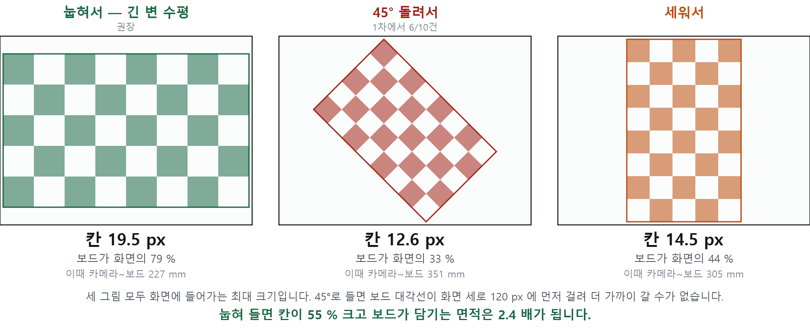
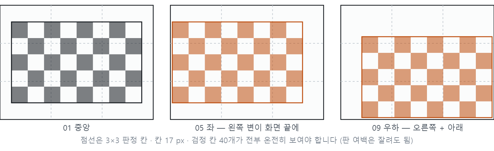
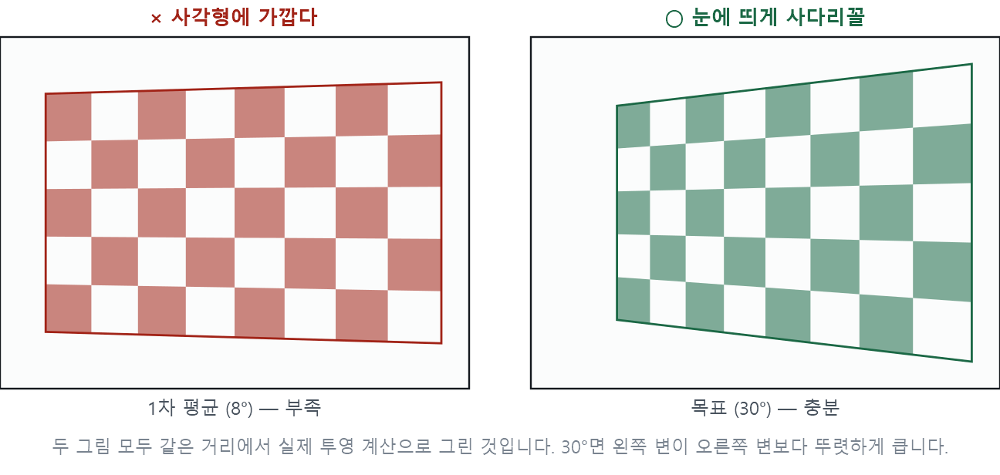
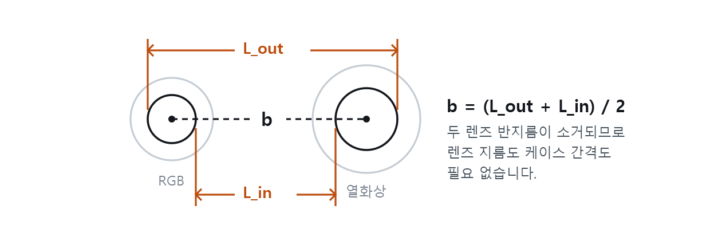

# 열화상 캘리브레이션 2차 촬영표

> **한 줄 요약** — 1차 촬영분에서 **초점거리(f = 147.4 px)가 확정**됐고, 프레임
> 재선택으로 **RMS 0.209 px** 까지 좋아졌습니다. 남은 것은 **RGB 0건**과
> **판을 눕혀 들기**입니다. 아래 18자세를 **RGB를 함께 녹화한 상태로 · 판을
> 눕혀서 · 5초씩 끊어** 찍으면 완결됩니다.

| | |
|---|---|
| 대상 카메라 | 192.168.0.151 (`.152`는 별도 세트 필요) |
| 보드 | 7×4 내부코너 · 칸 30 mm · 방사율 체커보드 |
| 확정일 | 2026-08-28 |
| 상세 근거 | 저장소 `docs/thermal_rgb_calibration.md` §5-5 |

---

## 1. 1차 촬영분 판정

검출·대비·초점거리는 해결됐습니다. 남은 것은 **자세 다양성**과 **RGB** 입니다.

아래는 **프레임 재선택 + f 고정(147.4)** 을 적용한 최종 판정입니다.

```bash
python3 calibrate_thermal.py calib/_all --frames 1 --focal 147.4 \
    --measured d350_01=350 --measured d400_01=400 --measured d450_01=450
```

| 항목 | 결과 | 기준 | 판정 |
|---|---|---|---|
| 검출 | 10 / 12 | — | 통과 |
| 보드 대비 | 1.71 ~ 5.84 ℃ | ≥ 1 ℃ | 통과 |
| 재투영 RMS | **0.343 px** | < 0.5 | **통과** |
| 초점거리 | **147.4 (줄자로 외부 확정)** | — | **통과** |
| 거리 폭 | 130 mm | ≥ 60 mm | 통과 |
| 자세 수 | 10개 | ≥ 15개 | 실패 |
| 보드 화면 점유 | 평균 25 % | ≥ 40 % | 실패 |
| **면내회전 20° 초과** | **5개** | 0개 | **실패** |
| 20° 이상 기울인 자세 | 3개 | ≥ 4개 | 실패 |
| 코너가 닿은 칸 | 8 / 9 (우하 없음) | 9 / 9 | 실패 |
| 코너 분포 폭 | 가로 67 % · 세로 79 % | ≥ 80 % | 실패 |
| **RGB 동시 녹화** | **파일 0건** | 필수 | **실패** |

### 사진만으로는 초점거리를 못 정합니다 — 그래서 줄자가 필요했습니다

f 를 `130` 으로 고정하든 `260` 으로 고정하든 RMS 가 3 % 밖에 안 나빠집니다.
정면 자세만 있고 보드가 화면 중앙에만 머물면 **f 를 키우는 효과와 왜곡계수 k1 을
키우는 효과가 서로 상쇄**되어 수학적으로 분리되지 않기 때문입니다.

줄자 실측이 이 문제를 풀었습니다 (§1-2). 2차에서도 **`--focal` 로 f 를 고정**해서
돌리십시오. 안 고정하면 기울임이 최대 3° 과대평가됩니다.

손으로 재단한 판은 원인이 **아닙니다.** 프레임 재선택 후 자세별 RMS 가
0.12~0.32 입니다.

## 1-2. ★ 줄자 실측으로 초점거리가 확정됐습니다

`th350`·`th400`·`th450` 이 **보드~열화상 렌즈 거리**(판에 수직, 보드 왼쪽 끝
기준)라는 것이 확인되면서, 사진만으로는 못 구하던 초점거리가 나왔습니다.

각 그룹에서 **`_01` 만 줄자를 정확히 댄 자세**입니다. `_02`·`_03` 은 그 근처에서
각도만 바꾼 것이라 위치 오차가 섞여 있으므로 스케일 검증에 쓰지 않습니다.

자세별 거리는 f 에 정비례하므로 `f_참값 = f × (줄자 / 계산거리)` 입니다.

| 자세 | 줄자 | 계산거리 | 차이 |
|---|---|---|---|
| `d400_01` | 400 mm | 394 mm | **−6 mm (1.6 %)** |
| `d450_01` | 450 mm | 454 mm | **+4 mm (0.8 %)** |
| `d350_01` | 350 mm | 375 mm | +25 mm (7.1 %) — 어긋남 |

`d350_01` 을 뺀 비례 모형: **비 1.004 ± 1.2 % → f = 148.0**.
보정을 전혀 쓰지 않고 순수 기하(`f = 칸px × 줄자 / 30`)로 계산해도 같습니다
(d400 → 148.0, d450 → 142.9).

자유 보정(168.8)은 줄자와 20.6 %, 사양값(208.4)은 48.7 % 어긋납니다.

#### ★ 프레임 선택이 절반을 좌우했습니다

`d450_01` 은 처음에 RMS 1.34 로 최악이었는데, **같은 녹화 안의 다른 프레임**을
쓰니 RMS 0.21, 거리 455 mm 로 줄자에 맞았습니다. 「가장 선명한」 프레임이
「코너가 가장 정확한」 프레임이 아니었던 것입니다.

`calibrate_thermal.py` 에 **프레임 재선택**을 넣었습니다 (기본 켜짐). 1차 보정
결과로 후보 프레임을 다시 평가해 재투영 오차가 가장 작은 것으로 교체합니다.

> 10자세 중 **8자세가 교체**되었고 전체 **RMS 0.615 → 0.209 px**.
> 재촬영 없이 얻은 개선입니다. 20° 이상 기울인 자세도 2개 → **4개**로 늘어
> 기준을 충족했습니다 (같은 녹화 안의 더 기울어진 순간이 선택됨).

### 확정값

| | 사양서 | **실측 확정** |
|---|---|---|
| f | 208.4 px | **147.4 px** (`_01` 만 쓰면 148.0 ± 1.2 %) |
| 화각 | 42° × 32° | **57.2° × 44.4°** |
| 457 mm 에서 GSD | 2.19 mm/px | **3.10 mm/px** |

이후 모든 스크립트는 `--focal 147.4` 로 이 값을 씁니다.

> **⚠ 보고서 영향** — 산업재산권 심의자료의 GSD 2.2 mm/px 와 그로부터 나온
> 크라운 실치수·오차 예산 항목이 **41 % 어긋납니다.** 재계산이 필요합니다.

#### `th350` 이 어긋난 이유 — 찾았습니다

`d350_01` 은 **2139프레임 / 246초짜리 폭주 녹화**(82 MB, 녹화 종료 실패)입니다.
60장을 훑어 2장만 검출됩니다. 4분 동안 판이 어디에 있었는지 알 수 없으므로
줄자 350 mm 와 짝지을 수 없습니다.

| 자세 | 길이 | 검출 | 면내회전 범위 | 중심 이동 |
|---|---|---|---|---|
| `d400_01` | 4 s | 35/35 | 3~4° | 2.6 px |
| `d450_01` | 4 s | 34/36 | 5~7° | 1.6 px |
| `dUNK_01` | **39 s** | 21/60 | **1~53°** | **18.3 px** |
| `d350_01` | **246 s** | **2/60** | — | — |

> **★ 녹화는 5초 안팎으로 끊으십시오.** 길면 한 파일 안에 여러 자세가 섞여
> «한 파일 = 한 자세» 가 깨집니다. `pair_rgb.py` 의 RGB 짝짓기도 함께 깨집니다.
> 위 표에서 4초짜리는 판이 1~2° 안에서 안정적이고, 39초짜리는 53° 까지
> 돌아갑니다.

### 기존 파일 처리

| 대상 | 처리 |
|---|---|
| `th` · `th350` · `th400` · `th450` | **10자세 전부 남깁니다.** 왜곡계수·주점에 계속 기여 |
| `d400_01` · `d450_01` | ★ 초점거리를 확정한 근거. 절대 지우지 마십시오 |
| `d450_01` | 이전에 «불량»으로 분류했으나 **프레임 재선택으로 정상**이 됐습니다 (RMS 1.34 → 0.21) |
| `dUNK_03` | 유일한 불량 (RMS 0.88). 빼면 RMS 0.343 → 0.190 |
| `d350` 3자세 | 남기되 **줄자 350 은 쓰지 마십시오** — 실제 375~399 mm 로 보입니다 |
| `th-test` · `th-test-01` | 검출 실패분. 삭제 |
| `th350/…162609.y16raw` | 82 MB / 2139프레임. 녹화 종료 실패 — 지워도 무방 |

---

## 2. 나가기 전에

### RGB를 반드시 함께 돌릴 것

1차는 전부 열화상뿐이라 스테레오(R·T)와 호모그래피를 구할 수 없습니다.
RGB는 **연속 녹화**로 두고, 나중에 `pair_rgb.py`가 자세별로 잘라냅니다.
시계 동기는 필요 없습니다 — **순서로 짝지웁니다.**

1차 촬영 때 RGB를 돌려두었다면 그 영상을 가져오십시오. 1차 10자세도 살아납니다.

### 열화상 카메라가 두 대인 점

1차는 전부 `.151`입니다. `.152`(송풍구역)도 RGB와 정합하려면 **카메라마다 K·왜곡이
다르고 쌍마다 R·T가 다르므로** 별개의 캘리브레이션이 필요합니다. 두 대 모두 쓸
계획이면 아래 18자세를 **카메라별로 한 세트씩** 찍으십시오.

### ★ 판을 눕혀 드십시오 — 1차의 가장 큰 손실

1차 10건 중 **5건이 판을 38~85° 돌려서** 들었습니다. 이것이 보드가 작게 담긴
진짜 이유입니다.



| 드는 방향 | 담을 수 있는 최대 칸 | 보드가 화면의 | 그때 거리 |
|---|---|---|---|
| **눕혀서 (긴 변 수평)** | **19.5 px** | **79 %** | 227 mm |
| 45° 돌려서 | 12.6 px | 33 % | 351 mm |
| 세워서 | 14.5 px | 44 % | 305 mm |

45°로 들면 보드 **대각선**이 화면 세로 120 px 에 먼저 걸려서 더 가까이 갈 수가
없습니다. 눕혀 들기만 해도 **칸이 55 % 크고 보드 면적이 2.4 배**가 됩니다.

면내회전 자체가 보정 정확도를 해치지는 않습니다. 손해는 전부 **크기**에서
납니다.

### 거리 — 1차보다 훨씬 가깝게

초점거리가 실측으로 확정됐습니다 (**f = 147.4 px**, §1-2). 그 값으로 계산하면:

| 목표 | 거리 |
|---|---|
| 칸 17 px (권장) | **약 260 mm** |
| 칸 19.5 px (한계) | 227 mm |
| 1차 실제 (칸 9.5~13 px) | 375~455 mm |

A조·B조는 **260~280 mm**, C조만 260 → 450 mm 로 벌리십시오.
그 거리에서 미리보기가 흐리지 않은지 한 장 찍어 확인하십시오.
`check_board.py`가 자세마다 칸 크기를 출력합니다.

### 화면 안에 들어와야 하는 것 — 판이 아니라 칸

**체커 칸 40개(5×8)가 전부 온전히** 보이면 됩니다.
**알루미늄 판 여백은 잘려도 됩니다.** 현장 프레임을 잘라가며 실측한 결과입니다.

| 바깥 칸이 보이는 정도 | 검출 |
|---|---|
| 100 % (판 여백 없이 칸만) | OK |
| 87 % | OK |
| 52 % | 실패 |

검출기가 찾는 것은 **내부 코너 28개**(4×7)지만, 바깥 칸이 반쯤 잘리면 그 줄의
코너를 못 잡습니다.

### 보드 크기와 이동 여유는 맞바꿈입니다

| 칸 크기 | 패턴 크기 | 가로 여유 | 화면 점유 |
|---|---|---|---|
| 11 px (1차) | 88 × 55 | 72 px | 11 % |
| 15 px | 120 × 75 | 40 px | 21 % |
| **17 px · 권장** | **136 × 85** | **24 px** | **27 %** |
| 19 px | 152 × 95 | 8 px | 34 % |

17 px면 좌우로 각 12 px, 실물로 **약 21 mm씩**밖에 못 움직입니다.
**그걸로 충분합니다** — 커버리지는 보드 중심이 아니라 **코너 위치**로 판정하기
때문입니다.

```
칸 17px, 보드를 왼쪽 끝까지 → 패턴 x 0~136, 내부코너 x 17~119
        3분할 경계는 53 / 107  →  17은 좌칸 OK,  119는 우칸 OK
```

한 자세만으로 좌·우 칸이 동시에 채워집니다. 1차가 실패한 것은 보드가 작아서가
아니라 **오른쪽 아래로 한 번도 안 밀었기** 때문입니다 — 코너가 x ≤ 127, y ≤ 106에
머물렀는데 우하 칸은 x > 107 *그리고* y > 80이 동시에 필요합니다.

---

## 3. 촬영 목록 · 18자세

순서대로 진행하십시오.

### A조 — 화면 9칸 채우기 · 9장

**각도를 주지 않고 옆으로 옮기기만** 합니다. 「좌」는 **보드 왼쪽 변이 화면 왼쪽
끝에 거의 닿게**라는 뜻입니다.



- [ ] **01 중앙** — 어느 가장자리에도 닿지 않게
- [ ] **02 좌상** — 왼쪽 + 위 두 변에 닿게
- [ ] **03 상** — 위에 닿게
- [ ] **04 우상** — 오른쪽 + 위
- [ ] **05 좌** — 왼쪽에 닿게
- [ ] **06 우** — 오른쪽에 닿게
- [ ] **07 좌하** — 왼쪽 + 아래
- [ ] **08 하** — 아래에 닿게
- [ ] **09 우하** — 오른쪽 + 아래 · **1차에서 비어 있던 칸**

### B조 — 기울임 · 6장

1차에 3장뿐이었습니다. 초점거리는 줄자로 따로 확정했지만(§1-2), 기울임은
여전히 **왜곡계수와 자세 안정성**에 필요합니다.

**기울이면 오히려 이동 여유가 늘어납니다.** 30° 기울이면 투영 폭이 cos 30° =
0.87배가 되어 칸 17 px에서도 가로 여유가 24 → 42 px가 됩니다. 중앙에 두지 말고
**기울임과 위치를 한 장에 같이** 담으십시오.



- [ ] **10 좌로 30° · 왼쪽으로** — 세로축 회전, 보드 왼쪽 변을 카메라 쪽으로
- [ ] **11 우로 30° · 오른쪽으로** — 오른쪽 변을 카메라 쪽으로
- [ ] **12 위로 25° · 위쪽으로** — 가로축 회전, 윗변을 카메라 쪽으로
- [ ] **13 아래로 25° · 아래쪽으로** — 아랫변을 카메라 쪽으로
- [ ] **14 좌 30° + 위 20°** — 좌상 모서리에
- [ ] **15 우 30° + 아래 20°** — 우하 모서리에

> 30°는 생각보다 많이 기울인 것입니다. 미리보기에서 보드가 **확실히 사다리꼴로
> 보여야** 합니다. 사각형에 가까우면 부족합니다.

### C조 — 거리 변화 · 3장

**세 자세 모두 줄자로 보드까지 거리를 재십시오** (§5). 16과 18의 간격을
**최대한 벌릴수록** 초점거리 검증이 정확해집니다 — 300 mm 목표.

- [ ] **16 가장 가까이 · 줄자 실측** — 보드가 화면을 꽉 채우기 직전
- [ ] **17 중간 · 줄자 실측**
- [ ] **18 가장 멀리 · 줄자 실측** — 잎 표면 거리 근처, 식물에 닿지 않는 선에서

---

## 4. 촬영 방법

| 순 | 할 일 |
|---|---|
| 1 | **판을 데웁니다.** 1차의 4~6 ℃ 대비가 목표. **냉각은 절대 금지** — 결로가 생기면 물의 방사율 0.96이 패턴을 지웁니다 |
| 2 | **RGB 연속 녹화를 시작합니다.** 끝까지 멈추지 않습니다 |
| 3 | 자세마다 — 위치·각도를 잡고 **3초 정지** → 열화상을 **5초 내외로 한 건 녹화**(자세당 파일 1개) → **녹화가 실제로 멈췄는지 확인** → **보드를 화각 밖으로 완전히 빼고 2초** |
| 4 | **5자세마다 판을 다시 데웁니다.** 대비가 떨어지면 검출이 실패합니다 |
| 5 | 양손은 보드 **바깥**을 잡습니다. 손이 격자를 가리면 안 됩니다 |
| 6 | **판을 눕혀서** (긴 변 수평). 1차의 가장 큰 손실이었습니다 |

3번의 **2초 공백**이 `pair_rgb.py`가 자세를 나누는 경계입니다. 보드가 계속 보이면
두 자세가 한 구간으로 붙습니다.

**녹화 길이를 매번 확인하십시오.** 1차에서 한 건이 246초(82 MB)로 폭주해
그 자세의 줄자 실측을 통째로 못 쓰게 됐습니다. 파일이 3 MB를 넘으면 이상합니다
(정상은 1.3~2 MB).

---

## 5. 실측 세 가지

이걸 안 재 오면 다시 가야 합니다.

| # | 대상 | 방법 | 정밀도 |
|---|---|---|---|
| 1 | **베이스라인** | 캘리퍼스로 두 렌즈를 가로질러 두 번 — 아래 도해 | ±0.4 mm |
| 2 | 렌즈 ~ **잎 표면** | 줄자. 캐노피는 거치대가 아니라 **잎층**입니다 | ±5 mm |
| 3 | **C조 세 자세**(16·17·18)에서 보드까지 | 줄자. **자세별 파일명을 적어둘 것** | ±5 mm |

### 1번 — 캘리퍼스로 베이스라인



- 바깥쪽 끝 ↔ 바깥쪽 끝 = `L_out`
- 안쪽 끝 ↔ 안쪽 끝 = `L_in`
- **b = (L_out + L_in) / 2**

`L_out = b + r₁ + r₂`, `L_in = b − r₁ − r₂` 이므로 두 렌즈 반지름이 정확히
소거됩니다. 열화상 렌즈가 원통 안쪽에 들어가 있으면 **경통 바깥 테두리**를 잡아도
같은 결과입니다.

> **이 한 번의 측정이 초점거리 문제의 두 번째 해법입니다.**
> 초점거리 축퇴는 **전체 스케일 축퇴**입니다 — f를 s배 키우면 추정 거리도 T도
> 전부 s배가 되고 투영은 그대로입니다. 따라서
> `f_참값 = f_추정 × (b_실측 / ‖T‖_추정)`, 베이스라인 하나가 f를 고정합니다.

| 측정법 | b 정밀도 | → f | → 거리 |
|---|---|---|---|
| 치수 합산 (25 + 22.5 + 간격) | ±2.3 mm | ±4.8 % | ±22 mm |
| **캘리퍼스 직접** | **±0.4 mm** | **±0.84 %** | **±4 mm** |

기울임을 늘리는 것과 **독립적인** 두 번째 안전장치라, 둘 다 하시는 게 좋습니다.

### 3번은 왜 한 개가 아니라 세 개인가

계산 거리와 줄자는 이런 관계입니다.

```
d_계산 = s × d_줄자 + c
```

| 항 | 뜻 | 원인 |
|---|---|---|
| **s ≠ 1** | 거리에 **비례**하는 오차 | **초점거리 f가 틀림** |
| **c ≠ 0** | 거리와 무관한 **고정** 오차 | 줄자를 **투영중심이 아닌 곳**에서 쟀음 |

계산이 말하는 거리는 렌즈 배럴 **안쪽의 투영중심**부터인데 줄자는 렌즈 앞면이나
케이스에 댈 수밖에 없고, 그 차이가 보통 **10~20 mm**입니다. 350 mm에서 3~6 %니까
s와 크기가 비슷합니다. **미지수 2개이므로 측정 1개로는 못 가립니다.**

**가까이~멀리 폭이 정밀도를 직접 결정합니다.** 줄자 오차 ±5 mm 기준:

| 측정 폭 | s 불확도 | |
|---|---|---|
| 70 mm | ±10 % | 쓸 수 없음 |
| 141 mm | ±5 % | 겨우 통과 |
| 200 mm | ±3.5 % | |
| **300 mm** | **±2.4 %** | **권장** |

`calibrate_thermal.py`가 s·c와 각각의 불확도를 계산하고, s 불확도가 5 %를 넘으면
«이 맞춤은 쓸 수 없습니다»라고 막습니다 — 폭이 좁으면 s와 c가 서로 상쇄되어
그럴듯한 숫자가 나오지만 실제로는 아무것도 결정되지 않기 때문입니다.

### 줄자를 댈 때

카메라 쪽 기준점을 **하나로 고정**하고 **어디였는지 적어두십시오**
(예: 열화상 경통 앞면). 어디로 잡든 `c`가 흡수하므로 **정확한 지점보다 일관성이
중요**합니다. 보드 쪽은 **시트지 표면**까지.

---

## 6. 돌아오기 전에 확인

하나라도 실패면 그 자리에서 더 찍으십시오. 다시 오는 비용이 훨씬 큽니다.

```bash
python3 check_board.py calib/th2/ --frames 1
python3 calibrate_thermal.py calib/th2/ --frames 1 \
    --measured pose16=<실측> --measured pose17=<실측> --measured pose18=<실측>
```

- [ ] 초점거리 결정력 **≥ 50 %**
- [ ] 20° 이상 기울인 자세 **≥ 4개**
- [ ] 코너가 닿은 칸 **9 / 9**
- [ ] 보드 화면 점유 **평균 ≥ 25 %**
- [ ] 줄자 대조 스케일 오차 **≤ 5 %** (3점이 서로 5 % 이내)
- [ ] 면내회전 20° 초과 자세 **0개**

`coverage.png`에 **어느 칸이 비었는지** 그림으로 나옵니다.

---

## 7. 사무실에서

```bash
# ① 열화상 내부 파라미터 — 1차 + 2차 전부 사용
python3 calibrate_thermal.py calib/_all/ --frames 1 --focal 147.4

# ② RGB 를 자세별로 잘라내기
python3 pair_rgb.py session.mp4 calib/th2/ --out calib/rgb/

# ③ 스테레오 + 기준면 호모그래피 — 2차 쌍만
python3 calibrate_pair.py calib/ --baseline <캘리퍼스 실측> \
    --depth <잎표면거리> --frames 1
```
