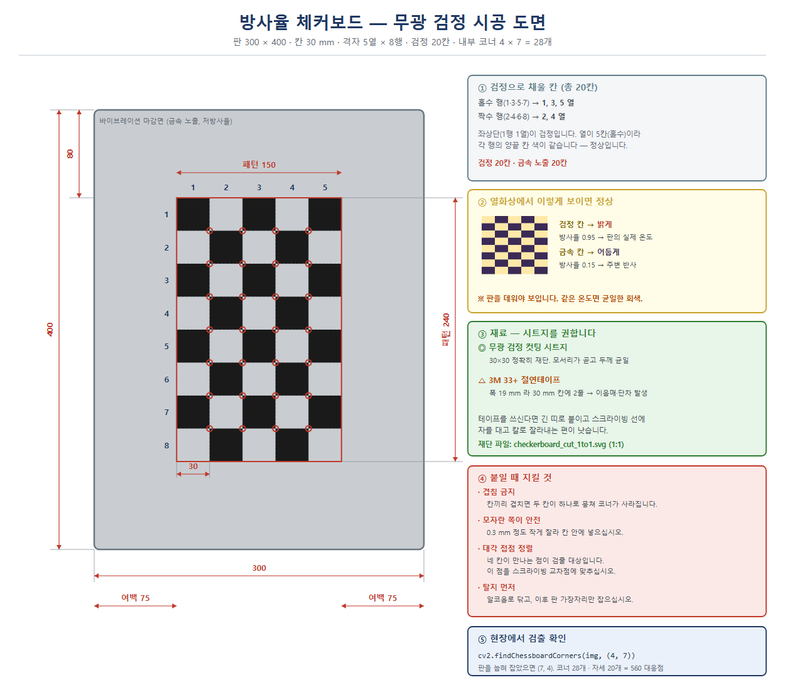

# 열화상 ↔ RGB 정합 캘리브레이션 가이드

**작성일**: 2026-08-11
**대상**: TMC160F (160×120, FOV 42°×32°) + RGB (1920×1080, 광각)
**전제**: 두 카메라가 알루미늄 레일에 매직암으로 인접 고정, 고정 후 불변

---

## 0. 결론 먼저

| 순서 | 무엇을 | 제작 시간 | 언제 |
|---|---|---|---|
| **1** | **방향 확정** (좌우까지 뒤집혔는지) | 없음 | **오늘, 1분** |
| **2** | **점 대응 호모그래피** (제작 불필요) | 없음 | **오늘, 30분** |
| **3** | **방사율 체커보드**로 정밀 캘리브레이션 | **1시간, ~1만원** | 이번 주 |
| 4 | (선택) 천공판·니크롬선 격자 | 반나절 | 정밀도 부족 시 |

**제작 리드타임이 걱정이라면 3번이 답입니다. 가열 장치가 필요 없어
알루미늄 판과 무광 흑색 테이프만 있으면 1시간이면 만듭니다.**

---

## 1. 왜 일반 체커보드가 안 되는가

열화상은 **가시광 반사율(색)이 아니라 방출 복사**를 봅니다.
종이에 인쇄한 검은 사각형과 흰 사각형은 **온도도 방사율도 거의 같으므로
열화상에서는 균일한 회색 판**으로만 보입니다.

열화상에서 패턴이 보이려면 다음 중 하나가 필요합니다.

| 원리 | 방법 | 난이도 |
|---|---|---|
| **온도차** | 뒤에서 가열, 냉각, 열선 | 중 |
| **방사율차** | 광택 금속 vs 무광 흑색 | **낮음 ★** |
| 반사차 | 금속면이 주변을 반사 | 낮으나 불안정 |

---

## 2. 방법 A — 제작 없이 오늘 (점 대응)

가장 빠른 경로입니다. 정밀도는 낮지만 **오늘 당장 동작하는 호모그래피**를 얻습니다.

### 준비물
소형 고온점 1개 — 인두기 팁, 손난로, 저항, 데운 볼트 등.
**작고 조밀할수록 좋습니다** (손은 안 됩니다 — 프레임 밖으로 이어져 중심이 흔들림).

### 절차

1. 고온점을 **캐노피 높이**(잎이 있는 평면, 약 457 mm)에 놓습니다
2. 두 카메라를 **동시에** 촬영합니다 (10초면 충분)
3. 위치를 바꿔 **8~12곳** 반복. 화면 네 모서리와 중앙을 고루 덮을 것
4. 각 위치에서 두 영상의 고온점 중심 좌표를 읽습니다
5. 호모그래피 추정

```python
import cv2, numpy as np
# pts_th: 열화상 좌표 (N,2),  pts_rgb: RGB 좌표 (N,2)
H, mask = cv2.findHomography(pts_rgb, pts_th, cv2.RANSAC, 3.0)
# RGB 마스크를 열화상 좌표계로:
warped = cv2.warpPerspective(rgb_mask, H, (160, 120))
```

### 한계
- 렌즈 왜곡을 보정하지 못합니다 (RGB 광각의 배럴 왜곡이 남음)
- 화면 가장자리에서 오차가 커집니다
- 그래도 **중앙부 개체 단위 작업에는 충분**합니다

---

## 3. 방법 B — 방사율 체커보드 ★ 권장

**가열 장치 불필요.** 광택 알루미늄(ε≈0.05)과 무광 흑색(ε≈0.95)의
방사율 차이만으로 열화상에 패턴이 나타납니다.

### 제작 (1시간, 약 1만원)

| 재료 | 사양 |
|---|---|
| **금속판 (권장: STS304 바이브레이션, 코팅 없음, 0.8~1.0 mm)** | 300×400 mm. 헤어라인·2B·알루미늄도 가능. **광택 불필요** — 아래 참조 |
| 무광 흑색 | 무광 흑색 비닐테이프 또는 무광 흑색 스프레이 + 마스킹 |
| 패턴 | 정사각 25~30 mm, 7×5 또는 9×6 격자 |
| 백킹 (얇은 판일 때) | MDF·아크릴. 평탄도와 강성 확보 |

1. **보호비닐을 벗기고** 표면을 탈지합니다 (지문·기름이 방사율을 바꿉니다)
2. 체커 패턴으로 무광 흑색 사각형을 붙이거나 칠합니다
3. 가장자리에 여백을 남깁니다 (코너 검출 안정화)

> 도료를 쓸 경우 완전 건조 후 사용. 반광택은 효과가 약합니다. **반드시 무광.**

### ★ 패턴 치수 — 열화상 화각에 맞춰야 합니다

`findChessboardCorners` 는 **보드 전체가 프레임 안에 보여야** 작동합니다.
캐노피 거리 457 mm 에서 열화상 시야가 **34.7 × 26.0 cm** 뿐이므로
패턴을 무작정 크게 만들면 프레임을 넘겨 검출이 실패합니다.

| 칸 크기 | 8×5칸 패턴 | 열화상 화소/칸 | 프레임 점유 | 판정 |
|---|---|---|---|---|
| 20 mm | 160×100 | 9.2 px | 46 × 38 % | ✗ 칸이 너무 작음 |
| 25 mm | 200×125 | 11.5 px | 58 × 48 % | ○ |
| **30 mm** | **240×150** | **13.8 px** | **69 × 58 %** | **◎ 적정** |
| 33 mm | 264×165 | 15.2 px | 76 × 63 % | ◎ 적정 |
| 40 mm | 320×200 | 18.4 px | 92 × 77 % | ✗ 여백 부족 |

#### 확정 패턴

> **무광 흑색 30 mm 정사각, 8 × 5 칸 → 내부 코너 7 × 4**
> 패턴 240 × 150 mm, 400×300 판에서 여백 가로 80 mm / 세로 75 mm
> `cv2.findChessboardCorners(img, (7, 4))`

- 열화상에서 칸이 **13.8 px** — 코너 검출에 충분
- 자세당 코너 28개 × 20자세 = **560 대응점** (내부 파라미터·호모그래피 모두 충분)
- **내부 코너를 홀수×짝수(7×4)로 잡은 이유**: 짝수×짝수(예 6×4)는 180° 회전
  모호성이 생겨 자세마다 코너 순서가 뒤바뀔 수 있습니다

> **★ 제작 완료 (2026-08-11)** — 무광 검정 컷팅 시트지로 시공 완료.
> 명함(50 × 90 mm) 기준 실측 결과 패턴 약 **147 × 238 mm** (공칭 150 × 240),
> 칸 **29.4 ∼ 29.8 mm**. 손재단이지만 오차 1 % 이내로 **사용에 문제 없습니다.**

### ★★ 촬영할 때는 판을 눕혀서 (긴 변을 수평으로)

패턴은 판 위에 세로로(5열 × 8행) 붙어 있지만, **촬영할 때는 판을 90° 눕혀
8칸이 가로로 오게** 잡으십시오. 세워서 잡으면 프레임을 넘칩니다.

| 촬영 거리 | 가로걸기 (8×5) 점유 | 세로걸기 (5×8) 점유 | 칸 크기 |
|---|---|---|---|
| 400 mm | 78 % × 65 % | 49 % × **105 %** ✗ | 15.6 px |
| **457 mm** (캐노피) | **68 % × 57 %** ◎ | 43 % × **92 %** ✗ 여백 부족 | 13.7 px |
| 550 mm (화분면) | 57 % × 48 % ◎ | 36 % × 76 % ○ | 11.4 px |
| 600 mm | 52 % × 44 % ◎ | 33 % × 70 % ○ | 10.4 px |

- 가로로 눕혀 잡으면 → 내부 코너 **7 × 4**, `findChessboardCornersSB(img, (7, 4))`
- `findChessboardCorners` 보다 **`findChessboardCornersSB` 가 훨씬 강인**합니다
  (저해상도·저대비에 강함). OpenCV 4.0 이상이면 이쪽을 먼저 쓰십시오.

#### 검출 가능성 사전 검증 ✅

160 × 120 열화상을 모사해 손재단 오차 0.5 mm, NETD 0.05 ℃, 광학 흐림까지
넣고 시험한 결과 **11개 조건 전부 검출 성공**했습니다.

| 조건 | 결과 |
|---|---|
| 457 mm · ΔT 5 ℃ · 정면 | OK (칸 13.7 px) |
| 457 mm · ΔT 5 ℃ · **30° 기울임** | OK |
| 550 mm · ΔT 2 ℃ · 25° 기울임 | OK (칸 11.4 px) |
| 600 mm · ΔT 5 ℃ · 25° 기울임 | OK (칸 10.4 px) |
| 457 mm · **ΔT 1 ℃** | OK |
| 판과 주변 온도가 같을 때 (ΔT 0) | **실패** ← 유일한 실패 조건 |

⇒ **검출 실패의 원인은 사실상 온도차 부족 하나뿐입니다.** 실패하면 칸 크기나
재단 정밀도를 의심하지 마시고 **판을 다시 데우십시오.**



| 파일 | 용도 |
|---|---|
| `assets/checkerboard_layout.svg` | 시공 도면 (검정 칸 위치·치수·주의사항) |
| **`assets/checkerboard_cut_1to1.svg`** | **1:1 재단 파일** — 30 mm 정사각 20개, 패턴 150×240 mm. 컷팅 업체에 그대로 전달 |

**검정으로 채울 칸** — 좌상단(1행 1열)부터 시작합니다.

| 행 | 검정 칸 (열) |
|---|---|
| 1 · 3 · 5 · 7 행 | **1, 3, 5 열** (3칸) |
| 2 · 4 · 6 · 8 행 | **2, 4 열** (2칸) |

합계 **검정 20칸 · 금속 노출 20칸**. 열이 5칸(홀수)이라 각 행의 양끝 칸 색이
같은데 정상입니다 — 판 둘레에 75/80 mm 의 금속 여백이 있어 검출에 지장 없습니다.

**붙일 때 지킬 것**

| 항목 | 내용 |
|---|---|
| **겹침 금지** | 칸끼리 겹치면 두 칸이 하나로 뭉쳐 **코너가 사라집니다** |
| 모자란 쪽이 안전 | 0.3 mm 정도 작게 잘라 칸 안에 넣으십시오 |
| 대각 접점 정렬 | 네 칸이 만나는 점이 검출 대상입니다. 스크라이빙 교차점에 맞추십시오 |
| 탈지 먼저 | 알코올로 닦고, 이후 판 가장자리만 잡으십시오 |

**재료** — 무광 검정 컷팅 시트지를 권합니다. 3M 33+ 는 폭이 19 mm 라 30 mm 칸에
두 줄을 붙여야 해서 이음매와 단차가 생깁니다. 테이프를 쓰신다면 긴 띠로 붙인 뒤
스크라이빙 선에 자를 대고 칼로 잘라내는 편이 낫습니다.

### ★ 알루미늄 판에 스크래치가 있어도 되는가 — 됩니다

**광택은 필수가 아닙니다.** 대비를 만드는 것은 광택이 아니라 **방사율 차이**입니다.

겉보기온도 ≈ ε·T_판 + (1−ε)·T_주변
→ 두 칸의 겉보기 온도차 **ΔT ≈ (ε_흑 − ε_금속) × (T_판 − T_주변)**

| 표면 상태 | ε | 판−주변 5°C 일 때 ΔT | 판정 |
|---|---|---|---|
| 알루미늄 포일 (주방용) | 0.04 | 4.55°C | ◎ 가장 확실 |
| 경면 연마 | 0.05 | 4.50°C | ◎ 단, 정반사로 얼룩 위험 |
| 압연 그대로 (밀 피니시) | 0.09 | 4.30°C | ◎ 일반 판재. 충분 |
| **긁힘·헤어라인** | **0.15** | **4.00°C** | **◎ 문제 없음** |
| 거칠게 산화 | 0.25 | 3.50°C | ◎ 여전히 사용 가능 |
| 심하게 부식·백화 | 0.40 | 2.75°C | ○ 가능하나 권장 안 함 |
| **무색 아노다이징** | **0.70** | 1.25°C | **✗ 피할 것** |
| 흑색 아노다이징 | 0.88 | 0.35°C | ✗ 사실상 대비 없음 |

**긁힘은 오히려 유리한 면이 있습니다.**

1. 긁힘은 ε 를 0.05 → 0.15 정도로 올릴 뿐이고, 무광 흑색(0.95)과의 차이는
   여전히 0.80 입니다. 대비 손실이 11% 에 불과합니다.
2. **경면은 정반사라 카메라 자신·LED·천장을 그대로 비춰 칸이 얼룩집니다**
   (나르시서스 효과). 긁힌 면은 확산반사라 주변을 평균해 **훨씬 균일한 칸**이
   나옵니다 — 코너 검출에 유리합니다.
3. RGB 쪽에서도 경면은 LED 반사로 포화됩니다. 긁힌 면이 낫습니다.

**진짜 피해야 할 것은 아노다이징입니다.** 겉보기엔 금속색이어도 방사율이
0.7~0.9 로 높아 대비가 사라집니다. **사무용·건축용 알루미늄 프로파일은
대부분 아노다이징 처리**되어 있으니 주의하십시오.

> **30초 확인법**: 판에 무광 흑색 테이프를 한 조각 붙이고 열화상으로 봅니다.
> 테이프와 맨판이 뚜렷이 다르게 보이면 합격입니다.

> **가장 값싼 대안**: **주방용 알루미늄 포일을 평평한 판(MDF·아크릴)에 붙이기.**
> ε≈0.04 로 확실하고, 약간의 주름은 확산반사를 만들어 오히려 좋습니다.
> 판이 아노다이징이거나 상태가 의심스러우면 이 방법이 가장 안전합니다.

### 스테인리스는 어떤가 — 오히려 권장할 만합니다

방사율만 보면 알루미늄이 약간 유리하지만, **실제로는 스테인리스가 더 나은
면이 많습니다.**

| 재질 | ε | Δε (흑 0.95 대비) | 판−주변 5°C 시 ΔT |
|---|---|---|---|
| 알루미늄 긁힘/헤어라인 | 0.15 | 0.80 | 4.00°C |
| **STS 헤어라인(#4)** | **0.20** | **0.75** | **3.75°C** |
| STS 2B (압연 그대로) | 0.22 | 0.73 | 3.65°C |
| STS 경면(#8) | 0.14 | 0.81 | 4.05°C |
| STS 열변색·산화 | 0.70 | 0.25 | 1.25°C ✗ |

**방사율 대비 손실은 6% 에 불과해 실질 차이가 없습니다.**

#### ★ 열전도도에서 스테인리스가 역전합니다

LED 아래에서 무광 흑색 칸은 빛을 훨씬 많이 흡수해 **실제로 더 뜨거워집니다.**
이 온도차가 유지되면 방사율 대비에 **실제 온도 대비가 더해집니다.**

| 재질 | 열확산율 α | 25 mm 칸 평준화 시간 | 차등 가열 |
|---|---|---|---|
| 알루미늄 | 97 mm²/s | **6.4초** | ✗ 즉시 균일화 → 사라짐 |
| **스테인리스 304** | **4.0 mm²/s** | **156초** | **◎ 수 분간 유지 → 대비에 가산** |

개략 계산(입사 150 W/m², 손실계수 25 W/m²K)으로 흑색과 STS 의 온도차가
약 **3.3°C** 생기며, 알루미늄은 전도로 대부분 상쇄됩니다.
**합산하면 스테인리스가 알루미늄을 앞설 수 있습니다.**

#### 실무 비교

| 항목 | 알루미늄 | 스테인리스 |
|---|---|---|
| 방사율 대비 | ◎ 0.80 | ○ 0.75 (차이 6%) |
| 차등 가열 보탬 | ✗ 전도로 상쇄 | **◎ 유지** |
| 판 온도 균일성 | ◎ 매우 균일 | △ 얼룩 가능 |
| 강성 (같은 두께) | △ E=69 GPa | **◎ E=193 GPa** |
| 긁힘·찍힘 내구성 | △ 무름 | **◎ 단단** |
| 무게 | ◎ 가벼움 | △ 약 3배 |
| **잘못 살 위험** | ✗ **아노다이징** | **◎ 없음** |
| RGB 정반사 눈부심 | △ 심함 | ○ 덜함 |

### ★★ 바이브레이션 마감이 최선입니다

가시광 광택을 죽여도 **LWIR 방사율은 거의 그대로 유지됩니다.**
두 파장의 차이 때문입니다.

정반사가 유지되는 조건(Rayleigh 기준, 수직 입사)은 **σ_RMS < λ/8**:

| 파장 | 정반사 유지 한계 σ |
|---|---|
| 가시광 0.55 μm | 0.069 μm |
| **LWIR 10 μm** | **1.25 μm** — 18배 관대 |

**σ 가 0.07 ~ 1.25 μm 구간이면 눈에는 무광인데 열화상에는 여전히 반사면입니다.**
바이브레이션 마감이 정확히 이 구간에 들어옵니다.

| 마감 | Ra (μm) | σ (μm) | 가시광 | LWIR | ε |
|---|---|---|---|---|---|
| 경면 #8 | 0.05 | 0.06 | 정반사(광택) | 정반사 | 0.14 |
| 2B | 0.10 | 0.12 | 확산(무광) | 정반사 | 0.22 |
| 헤어라인 #4 | 0.50 | 0.62 | 확산(무광) | 정반사 | 0.20 |
| **바이브레이션 (미세~보통)** | **0.4~0.8** | **0.5~1.0** | **확산(무광)** | **정반사 유지** | **0.22** |
| 바이브레이션 (거침) | 1.5 | 1.88 | 확산 | 부분 확산 | ~0.25 |
| 샌드블라스트 | 3~8 | 3.8~10 | 확산 | **확산·ε 상승** | 0.38 |

**바이브레이션의 ε 는 2B·헤어라인과 사실상 같은 0.22 입니다.**
대비 ΔT 는 판−주변 5°C 기준 3.65°C 로 충분합니다.

#### 우리 상황에서 특히 유리한 이유

현재 RGB 는 상단 61.8% 가 포화 상태입니다(LED 직사, 4-9).
**경면이나 2B 판을 쓰면 LED 정반사가 RGB 에 그대로 들어와 체커 칸이 하얗게
날아가고 코너 검출이 실패할 수 있습니다.**

바이브레이션은 이 문제를 해결합니다.

| 항목 | 효과 |
|---|---|
| 가시광 확산 | RGB 에서 **LED 반사 눈부심 없음** ◎ |
| LWIR 반사 유지 | 열화상 대비 그대로 ◎ |
| **무지향성(랜덤 스월)** | 15~25 자세로 기울여도 **균일하게 보임** ◎ |

마지막 항목이 중요합니다. 헤어라인은 방향성이 있어 판을 기울이면 자세마다
밝기가 달라지는데, 바이브레이션은 랜덤 스월이라 그런 문제가 없습니다.
여러 자세로 촬영하는 캘리브레이션 특성상 큰 장점입니다.

#### ⚠ 주문할 때 반드시 확인할 것

**투명 코팅(클리어) 여부.** 장식용 바이브레이션 판은 지문 방지 클리어를
입히는 경우가 있습니다. **폴리머 도막은 ε ≈ 0.9 라 대비가 완전히 사라집니다**
(ΔT 0.25°C — 사실상 사용 불가).

> 주문 시 **"코팅 없는 생지(bare) STS304 바이브레이션"** 으로 지정하십시오.

**샌드블라스트와 혼동하지 마십시오.** 샌드블라스트는 Ra 3~8 μm 로 LWIR 파장에
근접해 ε 가 0.38 까지 오릅니다. 바이브레이션(Ra 0.4~1.5 μm)과는 다릅니다.

#### ✅ 발주 확정 사양 (2026-08-11 업체 확인)

> **2B / 1.2T / 300×400 / 면모 O / 바이브레이션 작업**

| 항목 | 판정 | 비고 |
|---|---|---|
| 2B | ◎ | 바이브레이션의 바탕재. 2B 위에 기계 연마를 올리는 정상 공정 |
| **1.2T** | ◎ | 권장 0.8~1.0 보다 두껍지만 **더 좋음** (아래) |
| 300×400 | ◎ | 요청대로 |
| 면모 O | ◎ | 모서리 면취. 여러 자세로 들고 촬영하므로 안전상 유용 |
| 바이브레이션 | ◎ | 무지향성 무광 + LWIR 반사 유지 |

**1.2T 가 오히려 좋은 이유**

| 두께 | 무게 | 자중 처짐 (400 mm 스팬) | 강성 |
|---|---|---|---|
| 0.8 mm | 0.77 kg | 2.54 mm | 1.0× |
| 1.0 mm | 0.96 kg | 1.63 mm | 2.0× |
| **1.2 mm** | **1.15 kg** | **1.13 mm** | **3.4×** |

처짐 1.13 mm 는 화면 가장자리에서 **0.20 열화상 화소** 오차에 해당하며,
목표 재투영 오차 1.5 px 의 13% 로 무시 가능합니다.
무게 1.15 kg 도 들고 촬영하기에 무리 없습니다.
**백킹 없이 써도 되지만, 뒷면에 각재 2개를 세로로 대면 처짐이 사라집니다.**

#### ⚠ 수령 시 반드시 확인할 세 가지

사양서에 명시되지 않은 항목들입니다.

| # | 확인 | 문제가 되면 |
|---|---|---|
| 1 | **투명 코팅(클리어) 여부** | ε ≈ 0.9 → 대비 완전 소멸 |
| 2 | **보호비닐(PVC 필름)** | **반드시 벗길 것.** 안 벗기면 ε ≈ 0.9 |
| 3 | 연마 잔유물·지문 | 탈지 필요. 유분이 국소적으로 ε 를 올림 |

2번이 가장 흔한 실수입니다. 스테인리스 판은 보통 보호비닐이 붙어 오는데,
**비닐을 벗기지 않으면 금속이 아니라 폴리머를 촬영하게 됩니다.**

확인법은 동일: 무광 흑색 테이프 한 조각 붙이고 열화상으로 보기.

> **가장 큰 이점: 아노다이징 리스크가 없습니다.**
> 알루미늄의 최대 실패 요인이 아노다이징(ε 0.7~0.9)인데, 스테인리스는
> 그런 표면처리를 하지 않으므로 **잘못 살 일이 없습니다.**
> 확인 방법(무광 흑색 테이프 붙이고 열화상으로 보기)은 동일합니다.

### 왜 이게 잘 되는가

- **열화상**: 흑색부는 판의 실제 온도를, 금속부는 주변 반사를 보여줍니다 → 체커 대비
- **RGB**: 검정 vs 은색이라 그대로 잘 보입니다
- → **같은 보드 한 장으로 양쪽을 동시에 캘리브레이션**할 수 있습니다

### 대비를 키우는 요령

| 판−주변 온도차 | 겉보기 ΔT (ε=0.15 기준) | NETD 0.05°C 대비 |
|---|---|---|
| 1°C | 0.80°C | 16배 |
| 2°C | 1.60°C | 32배 |
| 5°C | 4.00°C | 80배 |
| 10°C | 8.00°C | 160배 |

**2°C 만 있어도 충분합니다.** LED 아래 10분 두면 2~5°C 는 쉽게 생깁니다.
그래도 약하면 판 뒷면에 따뜻한 물수건을 잠깐 대십시오.
경면 판을 쓸 경우 천장 반사로 얼룩지면 **판을 10~20° 기울이십시오.**

#### ⚠ 반드시 가열할 것 — 냉각은 금지

온도차를 만드는 방향은 **위(가열)로만** 잡으십시오.

- 실증 환경은 기온 22.7 °C · 상대습도 75 % → **이슬점 약 18 °C**
- 판을 이슬점 아래로 냉각하면 표면에 **결로**가 생깁니다
- **물의 방사율은 0.96** 이라 저방사율 금속부가 고방사율로 바뀌어
  **체커 패턴이 통째로 사라집니다**
- 냉장고·아이스팩으로 식히는 방법은 이 현장에서 쓰지 마십시오

#### 가열 시 주의

| 항목 | 지침 |
|---|---|
| 가열 위치 | **뒷면에서**. 앞면을 직접 가열하면 얼룩이 남아 칸마다 온도가 달라짐 |
| 균일화 | 금속 열확산율이 높아 수십 초면 균일해짐 (알루미늄 97 mm²/s) |
| 지속 시간 | 같은 이유로 **금방 식음**. 가열 후 **2~3분 안에** 촬영하고 다시 데울 것 |
| 운용 | 자세 5~6개 찍고 재가열 → 반복. 한 번에 25자세를 다 찍으려 하지 말 것 |

#### 붙이기 전 탈지 필수

지문·유분은 국소적으로 방사율을 올려 **금속부에 얼룩진 밝은 영역**을 만듭니다.
알코올로 전면을 닦고, 이후에는 **판 가장자리만 잡으십시오.**

---

## 4. 방법 C·D — 정밀도가 더 필요할 때

### C. 천공판 + 열원 (반나절)
알루미늄/아크릴 판에 지름 15~20 mm 구멍을 격자로 뚫고, 뒤에 전기방석·온열매트를
댑니다. 구멍으로 열이 새어 **원형 격자(circles grid)** 가 만들어집니다.
`cv2.findCirclesGrid` 로 검출합니다. 체커보드보다 검출이 안정적입니다.

### D. 니크롬선 격자 (반나절)
프레임에 니크롬선을 격자로 감고 저전압을 인가하면 선이 데워집니다.
RGB 에서도 선이 보입니다. 전원·안전 관리가 필요합니다.

### 즉석 대안 — 제빙 트레이
제빙 트레이 칸에 얼음물과 온수를 번갈아 채우면 즉석 열 격자가 됩니다.
정확도는 낮지만 **지금 당장** 가능합니다.

---

## 5. 촬영 절차 (방법 B·C·D 공통)

### 5-1. 반드시 지킬 것

| 항목 | 이유 |
|---|---|
| **두 카메라 동시 촬영** | 보드가 움직이면 대응이 깨짐 |
| **보드를 캐노피 높이에 둘 것** | 시차 오차 최소화 (4-11). 화분 평면에서 맞추면 잎에서 어긋남 |
| **15~25 자세** | 기울기·회전·거리를 다양하게 |
| **화면 가장자리까지 덮을 것** | 왜곡 계수는 주변부 데이터가 있어야 추정됨 |
| **열화상 FFC 직후 프레임 배제** | 상단 행이 깨짐 |
| **RGB 는 무손실 PNG 로 추출** | 압축 아티팩트가 코너 검출을 흔듦 |

### 5-2. 처리 — 스크립트 한 줄

#### 촬영 방식 — 열화상은 끊어서, RGB 는 계속

RGB 를 자세마다 따로 트리거하지 않고 **한 번에 계속 녹화**해 두는 편이 현장에서
훨씬 단순합니다. 그다음 `pair_rgb.py` 로 자세별 프레임을 뽑습니다.

```bash
# ① 자세별 RGB 프레임 추출 (열화상 파일 개수·순서에 맞춰 짝지음)
python3 pair_rgb.py session.mp4 calib/th/ --out calib/rgb/

# ② 캘리브레이션
python3 calibrate_pair.py calib/ --baseline 50 --depth 457 --frames 1
```

> **⚠ 시각(타임스탬프)으로 자르지 마십시오.** 실측 fps 가 30.55 인데 30 으로
> 가정하면 30분 뒤 32초가 어긋납니다. `pair_rgb.py` 는 영상에서 '보드가 보이는
> 구간'을 찾아 **순서로** 짝지으므로 시계 동기가 필요 없습니다.
>
> 대신 촬영할 때 **자세를 바꿀 때 보드를 화각에서 완전히 빼거나 가려 2초쯤**
> 두십시오. 그 공백이 자세 사이의 경계가 됩니다.

#### 입력 형식 — 영상·이미지·원본 아무거나

| 폴더 | 받는 형식 |
|---|---|
| `calib/th/` | **`.y16raw`(권장)** · `.png` `.jpg` · `.avi` `.mp4` |
| `calib/rgb/` | `.png` `.jpg` · `.mp4` `.avi` `.mov` `.mkv` |

- 영상은 균등 간격 15프레임을 훑어 **선명한 순으로** 검출을 시도합니다.
  흔들린 프레임이 섞여 있어도 쓸 만한 프레임이 자동으로 골라집니다.
- 녹화기 출력 폴더를 그대로 복사해도 됩니다. `.y16meta` `.csv` 는 무시하고,
  같은 이름에 여러 확장자가 있으면 **`.y16raw` > 이미지 > 영상** 순으로 씁니다.
- **규칙은 하나** — `th/` 와 `rgb/` 의 파일명(확장자 제외)을 같게.

```
calib/
  th/    pose01.y16raw  pose02.y16raw  ...
  rgb/   pose01.png     pose02.png     ...
```

```bash
python3 calibrate_pair.py calib/ --baseline 50 --depth 457
```

손으로 들고 찍으셨다면 `--frames 1` — '가장 선명한 한 장'을 골라 씁니다.

내부적으로 이 순서로 처리합니다.

```
① 코너 검출        양쪽 각각 findChessboardCornersSB
② 코너 순서 정렬    ★ 열화상↔RGB 명암 극성이 반대라 순서가 180° 어긋난다
③ 내부 파라미터     열화상·RGB 각각 calibrateCamera
④ 스테레오 외부     stereoCalibrate(FIX_INTRINSIC) → R, T
⑤ 평면 호모그래피    H(d) = K_t (R + T·nᵀ/d) K_r⁻¹
⑥ 검증            자세별 깊이와 재투영 오차, 깊이 감도
```

#### ⚠ 반드시 알아야 할 함정 3가지

이 세 가지는 모르고 진행하면 **조용히 틀린 결과**가 나옵니다.

**① 코너 순서가 두 카메라에서 180° 어긋납니다**

판을 데워 찍으면 열화상에서는 검정 칸이 **밝게**, RGB 에서는 **어둡게** 나옵니다.
체커보드 검출기는 명암 극성으로 시작 코너를 정하므로 두 카메라의 코너 순서가
반대가 됩니다. 그대로 `stereoCalibrate` 에 넣으면 **상대 회전이 179° 로 나오면서
결과가 통째로 망가집니다.**

**한 자세만 놓고는 판별할 수 없습니다.** 평면 격자는 180° 돌려 대응시켜도
호모그래피가 정확히 성립하므로 잔차로 구분되지 않습니다 (실측 잔차 차이가
0.02 px 수준 — 잡음과 구별 불가).

→ **기하로 판별합니다.** 두 카메라는 단단히 붙어 있으므로 **카메라간 상대
회전은 모든 자세에서 같아야 합니다.** 자세마다 '뒤집지 않음 / 뒤집음' 두 후보의
상대 회전을 구하고, 가장 많은 자세가 모이는 군집을 기준으로 삼습니다.
실측에서 **일치 편차가 0.2~0.5°** 로 떨어져 판별이 명확합니다.

**부수 효과 — 짝이 뒤바뀐 자세도 잡힙니다.** 다른 자세의 RGB 와 짝지어지면
상대 회전이 군집에서 크게 벗어납니다. 검증 시험에서 `pose03`↔`pose04` 를 일부러
바꿔치기했더니 그 둘만 정확히 지목하고 제외했습니다. `pair_rgb.py` 의 순서
매칭이 어긋났을 때를 막아 주는 안전망입니다.

**② 호모그래피는 자세들을 한꺼번에 넣으면 안 됩니다**

호모그래피는 **하나의 평면**에서만 성립합니다. 자세마다 보드 평면이 다르므로
모든 자세의 코너를 모아 `findHomography` 를 부르면 한 자세만 맞고 나머지는
전부 이상치로 버려집니다 (inlier 5 % 같은 값이 나옵니다).

→ 스테레오 외부 파라미터 `R, T` 를 먼저 구하고, 원하는 깊이 `d` 의 평면에 대해
`H(d) = K_t (R + T·nᵀ/d) K_r⁻¹` 로 유도해야 합니다. 이러면 캐노피·화분면 등
**어느 깊이의 호모그래피든 만들 수 있어** 깊이 오차도 바로 정량화됩니다.

> 부호 주의: 교과서에 흔한 `R − t·nᵀ/d` 는 평면을 `nᵀX + d = 0` 으로 두는
> 규약입니다. 여기서는 `nᵀX = d` (d = 깊이, 양수) 이므로 **플러스**입니다.

**③ 열화상도 왜곡 보정해야 합니다**

RGB 만 보정하고 열화상 원본에 호모그래피를 걸면, 열화상 렌즈 왜곡은
호모그래피로 표현할 수 없으므로 그대로 오차로 남습니다.
→ **양쪽 모두 `undistort` 한 좌표계**에서 정합하십시오.

### 5-3. 합격 기준

| 지표 | 합격 | 목표 |
|---|---|---|
| 자세 수 (양쪽 모두 검출) | ≥ 15 | 20 |
| 열화상 재투영 RMS | < 0.5 px | 0.3 |
| RGB 재투영 RMS | < 1.0 px | 0.5 |
| 스테레오 RMS | < 1.0 px | — |
| **기준면 호모그래피 오차** | **< 1.5 열화상 px** | 1.0 |
| 기준 깊이 ±30 mm 자세 | ≥ 3개 | 5개 |

`calibrate_pair.py` 가 이 표를 그대로 출력하고 합격 여부를 판정합니다.

#### 파이프라인 검증 ✅

알려진 파라미터로 만든 합성 자세 22개로 시험한 결과입니다.

| 항목 | 참값 | 복원값 |
|---|---|---|
| RGB f | 1597.7 | 1598.2 |
| RGB 주점 | (966.0, 536.0) | (966.1, 535.8) |
| RGB k1 | −0.230 | −0.2304 |
| 베이스라인 | 50.05 mm | **49.5 mm** |
| 두 카메라 상대 회전 | 0.628° | **0.62°** |
| 기준면 호모그래피 오차 | — | **1.00 px** |

열화상 2 화소는 GSD 2.2 기준 약 4.4 mm 입니다. 개체 단위(크라운 42~69 px)에는
충분하고, 잎 단위로 갈 때는 깊이 관리가 필요합니다 (6장).

---

## 5-4. 현장에서는 열화상만 저장할 때 ★

RGB 처리를 사무실에서 하는 경우, 현장에서 **열화상만으로 판정 가능한 것을 전부
판정**하고 돌아와야 합니다. 다시 가는 비용이 크기 때문입니다.

```bash
python3 calibrate_thermal.py calib/th/ --frames 1     --canopy 470 --measured pose04=475 --measured pose15=439
```

| 열화상 단독으로 판정 가능 | RGB 가 있어야 판정 가능 |
|---|---|
| 자세 수 · 코너 검출 | 스테레오 외부 파라미터 R·T |
| **내부 파라미터 K·왜곡계수** | 베이스라인 |
| 재투영 RMS | 평면 호모그래피 |
| 화면 커버리지 · 기울임 · 거리 분포 | |
| 보드 대비(℃) | |
| **보드 기하로 역산한 거리 ↔ 줄자 대조** | |

### 현장 판정 기준

| 지표 | 합격 |
|---|---|
| 자세 수 | ≥ 15 |
| 재투영 RMS | < 0.5 px (목표 0.3) |
| **초점거리 결정력** | **≥ 50 %** |
| **보드 화면 점유** | **평균 ≥ 25 %** |
| 코너가 닿은 3×3 칸 | 9/9 |
| 코너 분포 폭 | 가로·세로 각 ≥ 80 % |
| 20° 이상 기울인 자세 | ≥ 4개 |
| 보드 거리 폭 | ≥ 60 mm |
| 보드 대비 | ≥ 1 ℃ (전 자세) |
| 줄자 대조 오차 | ≤ 5 % |

> **초점거리 결정력**(2026-08-28 추가)이 가장 중요한 항목입니다. RMS가 낮아도
> f가 결정되지 않을 수 있습니다. 정면 자세만 있거나 보드가 화면 중앙에만
> 머물면 **f를 키우는 효과와 왜곡계수 k1을 키우는 효과가 서로 상쇄**되어
> 수학적으로 분리되지 않습니다. 그러면 역산 거리와 깊이별 호모그래피 H(d)가
> 통째로 틀리는데, **RMS만 봐서는 절대 잡을 수 없습니다.**
>
> 스크립트가 f를 −30 %/+40 %로 강제 고정해 RMS가 얼마나 나빠지는지로 잽니다.
> 1차 촬영분(10자세)은 이 값이 **3 %** 였습니다 — 사실상 미결정.

`coverage.png` 로 **어느 방향을 못 찍었는지** 그림으로 나옵니다. 부족한 칸이
있으면 그 방향으로 보드를 밀어 몇 장 더 찍으십시오.

> 커버리지는 **보드 중심이 아니라 코너 점** 기준입니다. 보드가 화면의
> 68 % × 57 % 를 채우므로 중심은 좌우·상하 1/3 칸에 물리적으로 들어갈 수
> 없습니다. 왜곡 계수에 필요한 것은 '주변부 코너 관측'이므로 코너 기준이 옳습니다.

---

## 5-5. ★ 2차 촬영 지침 (2026-08-28 확정)

1차 촬영분(`calib/`, 열화상 12건)을 분석한 결과와, 그에 따라 무엇을 어떻게 더
찍어야 하는지입니다.

### 5-5-1. 1차 촬영분 판정

| 항목 | 결과 | 판정 |
|---|---|---|
| 검출 | 10/12 | ✅ |
| 보드 대비 | 4.06~5.84 ℃ (th350/400/450) | ✅ 가열법 해결 |
| 코너 검출 정밀도 | 8자세가 RMS 0.14~0.45 | ✅ 손재단 판은 문제 없음 |
| 자세 수 | 10 | ✗ 15 필요 |
| **초점거리 결정력** | **3 %** | **✗ f 미결정 — 치명적** |
| 20° 이상 기울임 | 2개 | ✗ 4개 필요 |
| 보드 화면 점유 | 평균 19 % | ✗ 25 % 필요 |
| 코너가 닿은 칸 | 8/9 (우하 없음) | ✗ |
| 코너 분포 폭 | 가로 64 % · 세로 79 % | ✗ 각 80 % 필요 |
| **RGB 동시 녹화** | **없음** | **✗ 스테레오 불가** |

**쓸 수 없는 이유는 하나로 요약됩니다.** f를 130으로 고정하든 260으로 고정하든
RMS가 0.612 → 0.635로 3 %밖에 나빠지지 않습니다. 이 데이터는 초점거리를
결정하지 못하고, 따라서 역산 거리(446/454/523 mm)도 `H(d)`도 의미가 없습니다.

원인은 **정면 자세 위주 + 보드가 화면 중앙에만 머묾** 두 가지입니다.

#### 폴더 이름 350/400/450 은 스케일 고정에 쓸 수 없습니다

그 값은 **카메라~캐노피** 거리인데, 추정 보드 거리는 350 → 446, 400 → 454 로
거의 차이가 없습니다. 캐노피 위치만 바뀌고 보드는 비슷한 곳에서 들었던 것으로
보입니다. 스케일을 잡으려면 **그 자세에서 보드까지의 거리**를 재야 합니다.

#### 버릴 것 · 남길 것

| 대상 | 처리 |
|---|---|
| `calib/th`, `th350`, `th400`, `th450` (10자세) | **남깁니다.** 열화상 내부 파라미터에 계속 기여합니다 |
| `d450_01` (RMS 1.334) | 계산에서 제외. 이 한 장이 전체 RMS를 0.467 → 0.612 로 끌어올립니다 |
| `th350/…_162609.y16raw` (82 MB / 2139프레임) | 녹화 종료 실패. 검출은 되므로 급하지 않지만 지워도 됩니다 |
| `th-test`, `th-test-01` | 검출 실패분. 삭제 |

### 5-5-2. ⚠ 먼저 확인할 것 — RGB 가 돌고 있었는가

`calib/` 전체가 151(열화상)뿐이고 **RGB 파일이 하나도 없습니다.**

- **RGB를 연속 녹화해 두었다면** → 그 영상을 가져오면 1차 10자세도 살릴 수 있습니다.
- **녹화하지 않았다면** → 1차 10자세는 **열화상 내부 파라미터 전용**입니다.
  스테레오(R·T)와 호모그래피는 2차 촬영분만으로 구해야 합니다.

어느 쪽이든 **2차 촬영은 반드시 RGB를 함께 돌린 상태에서** 해야 합니다.

### 5-5-3. ⚠ 열화상 카메라가 두 대라는 점

1차는 전부 `.151` 입니다. `.152`(송풍구역)도 RGB와 정합하려면 **카메라마다
K·왜곡이 다르고 쌍마다 R·T가 다르므로 별개의 캘리브레이션이 필요합니다.**
두 대 모두 쓸 계획이면 아래 촬영을 카메라별로 한 세트씩 하십시오.

### 5-5-4. 추가 촬영 목록 — 18자세

**전부 RGB를 연속 녹화한 상태에서** 찍습니다. 순서대로 진행하십시오.

거리는 **1차보다 가깝게** — 보드 긴 변이 화면 가로의 3/4을 채우는 정도
(칸이 15 px, 1차는 11 px). 1차 위치에서 3/4쯤 다가가면 됩니다.

#### ★ 화면 안에 들어와야 하는 것 — 판이 아니라 칸입니다

**체커 칸 40개(5×8)가 전부 온전히** 보이면 됩니다. **알루미늄 판 여백은 잘려도
됩니다.** 현장 프레임을 잘라가며 실측한 결과입니다.

| 바깥 칸이 보이는 정도 | 검출 |
|---|---|
| 100 % (판 여백 없이 칸만) | OK |
| 87 % | OK |
| 52 % | 실패 |

검출기가 찾는 것은 **내부 코너 28개**(4×7)지만, 바깥 칸이 반쯤 잘리면 그 줄의
코너를 못 잡습니다. 기준은 **바깥 칸 한 줄이 온전히 보이게**.

#### ★ 보드 크기와 이동 여유는 맞바꿈 관계입니다

| 칸 크기 | 패턴 크기 | 가로 여유 | 화면 점유 |
|---|---|---|---|
| 11 px (1차) | 88 × 55 | 72 px | 11 % |
| 15 px | 120 × 75 | 40 px | 21 % |
| **17 px (권장)** | **136 × 85** | **24 px** | **27 %** |
| 19 px | 152 × 95 | 8 px | 34 % |

17 px면 좌우로 각 12 px, 실물로 **약 21 mm씩**밖에 못 움직입니다. **그걸로
충분합니다** — 커버리지는 보드 중심이 아니라 **코너 위치**로 판정하기 때문입니다.

```
칸 17px, 보드를 왼쪽 끝까지 → 패턴 x 0~136, 내부코너 x 17~119
        3분할 경계는 53 / 107  →  17은 좌칸 ✓,  119는 우칸 ✓
```

한 자세만으로 좌·우 칸이 동시에 채워집니다. 1차가 실패한 것은 보드가 작아서가
아니라 **오른쪽 아래로 한 번도 안 밀었기** 때문입니다 — 코너가 x ≤ 127, y ≤ 106
에 머물렀는데 우하 칸은 x > 107 **그리고** y > 80 이 동시에 필요합니다.

#### A조 — 화면 9칸 채우기 (9장, 정면 그대로 평행이동)

**각도는 주지 않고 옆으로 옮기기만** 합니다. 「좌」는 보드 **왼쪽 변이 화면 왼쪽
끝에 거의 닿게**라는 뜻입니다.

| # | 위치 | 보드가 닿을 화면 가장자리 |
|---|---|---|
| 01 | 중앙 | 없음 |
| 02 | 좌상 | 왼쪽 + 위 |
| 03 | 상 | 위 |
| 04 | 우상 | 오른쪽 + 위 |
| 05 | 좌 | 왼쪽 |
| 06 | 우 | 오른쪽 |
| 07 | 좌하 | 왼쪽 + 아래 |
| 08 | 하 | 아래 |
| 09 | **우하** | **오른쪽 + 아래 — 1차에서 비어 있던 칸** |

#### B조 — 기울임 (6장) ★ 기울이면서 화면 곳곳으로

**여기가 초점거리를 결정하는 핵심입니다.** 1차에 2장뿐이라 전부 틀어졌습니다.

**기울이면 오히려 이동 여유가 늘어납니다.** 30° 기울이면 투영 폭이 cos 30° =
0.87배가 되어 칸 17 px에서도 가로 여유가 24 → 42 px로 늘어납니다. 그러니 B조는
중앙에 두지 말고 **기울임과 위치를 한 장에 같이 담으십시오.** 자세 하나가 두
몫을 합니다.

| # | 기울임 | 위치 | 방법 |
|---|---|---|---|
| 10 | 좌로 30° | 왼쪽으로 밀어서 | 세로축 회전 — 보드 왼쪽 변을 카메라 쪽으로 |
| 11 | 우로 30° | 오른쪽으로 | 오른쪽 변을 카메라 쪽으로 |
| 12 | 위로 25° | 위쪽으로 | 가로축 회전 — 윗변을 카메라 쪽으로 |
| 13 | 아래로 25° | 아래쪽으로 | 아랫변을 카메라 쪽으로 |
| 14 | 좌 30° + 위 20° | 좌상 모서리 | 복합 |
| 15 | 우 30° + 아래 20° | **우하 모서리** | 복합 |

> 30°는 생각보다 많이 기울인 것입니다. **보드가 눈에 띄게 사다리꼴로 보여야**
> 합니다. 사각형에 가까워 보이면 부족합니다.

#### C조 — 거리 변화 (3장, 정면)

| # | 거리 | 목표 |
|---|---|---|
| 16 | 가장 가까이 | 보드가 화면을 꽉 채우기 직전 |
| 17 | 중간 | |
| 18 | 가장 멀리 | 잎 표면 거리 근처 (식물에 닿지 않는 선에서) |

### 5-5-5. 촬영 방법

1. **판을 데웁니다.** 1차의 4~6 ℃ 대비가 목표입니다. 냉각은 절대 금지
   (§3 결로 경고).
2. **RGB 연속 녹화를 시작합니다.** 끝까지 멈추지 않습니다.
3. 자세마다:
   - 보드를 위치·각도에 맞춰 들고 **3초 정지**
   - 열화상을 **5초 내외로 한 건 녹화** (자세당 파일 1개)
   - 녹화 정지 후 **보드를 화각 밖으로 완전히 빼고 2초** 대기
     → 이 공백이 `pair_rgb.py` 가 자세를 나누는 경계입니다
4. **5자세마다 판을 다시 데웁니다.** 대비가 떨어지면 검출이 실패합니다.
5. 양손은 보드 바깥을 잡습니다 (손이 격자를 가리면 안 됨).

### 5-5-6. 반드시 실측해 올 세 가지

| # | 대상 | 방법 | 목표 정밀도 |
|---|---|---|---|
| 1 | **베이스라인** | 버니어 캘리퍼스로 두 렌즈 개구를 가로질러 **바깥끝↔바깥끝 `L_out`**, **안쪽끝↔안쪽끝 `L_in`** 두 번. **b = (L_out + L_in)/2** | ±0.4 mm |
| 2 | 렌즈 ~ **잎 표면** 거리 | 줄자 | ±5 mm |
| 3 | **C조 세 자세(16·17·18)에서 보드까지** 거리 | 줄자. 자세별 파일명을 적어둘 것 | ±5 mm |

#### ★ 3번은 왜 한 개가 아니라 세 개인가

계산 거리와 줄자는 이런 관계입니다.

```
d_계산 = s × d_줄자 + c
```

| 항 | 뜻 | 원인 |
|---|---|---|
| **s ≠ 1** | 거리에 **비례**하는 오차 | **초점거리 f 가 틀림** |
| **c ≠ 0** | 거리와 무관한 **고정** 오차 | 줄자를 **투영중심이 아닌 곳**에서 쟀음 |

계산이 말하는 거리는 렌즈 배럴 **안쪽의 투영중심**부터인데 줄자는 렌즈 앞면이나
케이스에 댈 수밖에 없고, 그 차이가 보통 **10~20 mm** 입니다. 350 mm 에서 3~6 %
니까 s 와 크기가 비슷합니다. **미지수 2개이므로 측정 1개로는 못 가립니다.**

| 측정 | 얻는 것 |
|---|---|
| 1개 | 대략적 이상 유무만. s 와 c 를 분리 못 함 |
| 2개 | s 와 c 둘 다 (최소 조건) |
| **3개** | + 잔차로 측정 자체의 신뢰도 검증 |

**가까이~멀리 폭이 정밀도를 직접 결정합니다.** 줄자 오차 ±5 mm 기준:

| 측정 폭 | s 불확도 |
|---|---|
| 70 mm | ±10 % — 쓸 수 없음 |
| 141 mm | ±5 % — 겨우 통과 |
| **200 mm** | **±3.5 %** |
| 300 mm | ±2.4 % — 권장 |

`calibrate_thermal.py` 가 s·c 와 **각각의 불확도**를 계산하고, s 불확도가 5 %
를 넘으면 «이 맞춤은 쓸 수 없습니다» 라고 막습니다. 폭이 좁으면 s 와 c 가 서로
상쇄되어 그럴듯한 숫자가 나오지만 실제로는 아무것도 결정되지 않기 때문입니다.

**C조 16(가까이)과 18(멀리)의 간격을 최대한 벌리십시오.**

#### 줄자를 댈 때

- 카메라 쪽 기준점을 **하나로 고정**하고 **어디였는지 적어두십시오**
  (예: 열화상 경통 앞면). 어디로 잡든 `c` 가 흡수하므로 **정확한 지점보다
  일관성이 중요**합니다.
- 보드 쪽은 **시트지 표면**까지.

> **1번이 f 문제의 두 번째 해법입니다.** 초점거리 축퇴는 전체 스케일 축퇴이므로
> `f_참값 = f_추정 × (b_실측 / ‖T‖_추정)` 로 베이스라인 하나가 f를 고정합니다.
> 캘리퍼스법은 두 렌즈 반지름이 소거되어 렌즈 지름도 케이스 간격도 필요 없습니다.
> ±0.4 mm면 f를 ±0.84 %, 거리를 ±4 mm로 묶습니다.
> 치수 합산(25 + 22.5 + 간격)은 ±2.3 mm라 f ±4.8 %에 그칩니다.

### 5-5-7. 현장에서 돌아오기 전에 확인

```bash
python3 check_board.py calib/th2/ --frames 1
python3 calibrate_thermal.py calib/th2/ --frames 1 --measured <정면자세>=<실측mm>
```

아래 4개가 통과하면 됩니다. **하나라도 ✗ 면 그 자리에서 더 찍으십시오.**

| 지표 | 합격 |
|---|---|
| 초점거리 결정력 | ≥ 50 % |
| 20° 이상 기울임 | ≥ 4개 |
| 코너가 닿은 칸 | 9/9 |
| 보드 화면 점유 | 평균 ≥ 25 % |

`coverage.png` 에 **어느 칸이 비었는지** 그림으로 나옵니다.

### 5-5-8. 사무실에서

```bash
# ① 열화상 내부 파라미터 — 1차 + 2차 전부 사용
python3 calibrate_thermal.py calib/_all/ --frames 1

# ② RGB 를 자세별로 잘라내기
python3 pair_rgb.py session.mp4 calib/th2/ --out calib/rgb/

# ③ 스테레오 + 기준면 호모그래피 — 2차 쌍만
python3 calibrate_pair.py calib/ --baseline <캘리퍼스 실측> --depth <잎표면거리> --frames 1
```

---

## 6. 정합 깊이를 어디로 잡을 것인가 ★

이 프로젝트에서 가장 중요한 선택입니다.

### ⚠ 용어 — 캐노피는 프레임이 아니라 잎층입니다

**캐노피(canopy) = 잎이 모여 이루는 층(엽층).** 화분을 담은 구조물은
거치대·베드입니다. 이 문서의 "캐노피 457 mm" 는 **렌즈에서 잎 표면까지의
거리**를 뜻합니다.

엽온을 재는 면이 잎 표면이므로 정합도 그 면에서 맞춰야 합니다. 거치대 기준으로
잡으면 잎에서 어긋납니다.

### ★ 보드를 잎 표면까지 가져갈 필요는 없습니다

현장에는 이미 화분·잎·화방이 자라 있어 보드를 밀어 넣으면 식물이 훼손됩니다.
다행히 그럴 필요가 없습니다.

`calibrate_pair.py` 는 호모그래피를 보드 사진에서 직접 구하지 않고,
**스테레오 외부 파라미터 R·T 에서 원하는 깊이에 대해 수식으로 유도**합니다.

```
H(d) = K_t · (R + T·nᵀ/d) · K_r⁻¹
```

`R, T` 는 **깊이와 무관**합니다. 따라서

- 보드는 **식물을 건드리지 않는 편한 거리**에 두고 찍으면 됩니다
- 잎 표면 거리는 **줄자로 재서 `--depth` 에 숫자로 넣기만** 하면 됩니다

### 그 대신 반드시 실측해 올 세 가지

| 측정 | 무엇을 만회하나 |
|---|---|
| **카메라 간 베이스라인** | 스테레오 `T` 크기 검증. 추정값과 10 % 이상 벌어지면 경고 |
| **렌즈 ~ 잎 표면 거리** | 이게 곧 `--depth`. 없으면 어느 면을 맞출지 정할 수 없음 |
| **정면 자세의 보드 ~ 카메라 거리** | **스케일 전체의 독립 검증.** 스크립트가 30 mm 칸 기하로 역산한 거리와 줄자가 5 % 안에서 맞으면, 내부 파라미터·칸 크기·검출이 모두 옳다는 증거 |

세 번째가 특히 값집니다. GSD 가 두 번 뒤집힌 이력(3장)이 있는데, 독립적인 줄자
측정과 대조되는 것은 이번이 처음입니다.

### 그리고 두 가지 요령

1. **보드를 2~3개의 서로 다른 거리에서 찍으십시오** (예: 350 / 400 / 450 mm).
   스크립트가 각 깊이에서 `H(d)` 가 맞는지 검증하므로, 여러 깊이에서 다 맞으면
   **깊이 모델이 확인된 것**이고 잎 표면까지 외삽할 근거가 생깁니다.
   한 거리에서만 찍으면 외삽을 믿을 근거가 없습니다.
2. **식물 없는 옆자리를 쓰십시오.** 열 끝이나 빈 구간이 있으면 **같은 거리에서
   옆으로 비켜** 보드를 둘 수 있습니다. 화각 안에만 들어오면 깊이는 유지하면서
   식물을 건드리지 않습니다.

> 외삽이 50 mm 를 넘으면 `calibrate_pair.py` 가 경고합니다.

### 시차의 원리

- 두 카메라 사이 베이스라인 b 때문에 **평면 호모그래피는 한 깊이에서만 정확**합니다
- 다른 깊이에서는 `f_px · b · (1/d0 − 1/d)` 만큼 어긋납니다

| 베이스라인 | 화분 평면(550mm) ↔ 캐노피(457mm) 오차 |
|---|---|
| 30 mm | 2.3 열화상 화소 |
| 50 mm | 3.9 화소 |
| 80 mm | 6.2 화소 |
| 120 mm | 9.3 화소 |

**엽온이 목적이므로 캘리브레이션 보드를 캐노피 높이에 두십시오.**
그리고 **두 카메라를 최대한 붙이십시오** — 오차가 베이스라인에 선형 비례합니다.
현재 매직암으로 고정되어 있으니 조금 더 붙일 여지가 있는지 확인할 가치가 있습니다.

> 근본 해소는 깊이 인지 정합(스테레오·깊이맵)이지만, 개체 단위 목표에는
> 평면 호모그래피로 충분합니다.

---

## 7. 캘리브레이션 후 고정해야 할 것

한 번 맞추면 카메라가 고정된 한 영구 사용합니다. 다음을 파일로 저장하십시오.

```json
{
  "rgb_K": [[...]], "rgb_dist": [...],
  "thermal_orientation": "flip_vertical | rotate_180",
  "H_rgb_to_thermal": [[...]],
  "calib_depth_mm": 457,
  "baseline_mm": null,
  "reproj_error_thermal_px": null,
  "date": "2026-08-__",
  "note": "카메라·거치대를 건드리면 재캘리브레이션 필요"
}
```

**거치대를 조정하거나 카메라를 만지면 반드시 재캘리브레이션하십시오.**
매직암은 진동·접촉으로 조금씩 틀어질 수 있으므로, 월 1회 검증용 고온점 촬영으로
재투영 오차를 점검할 것을 권합니다.

---

## 8. 방향 — 180° 회전으로 확정됨 ✅

상하 반전 후에도 좌우가 뒤집혀 있음이 확인되었습니다.
**열화상 = RGB 를 180° 회전한 것**입니다 (카메라가 거꾸로 장착됨).

```python
th_aligned = cv2.rotate(th, cv2.ROTATE_180)   # 또는 th[::-1, ::-1]
# 좌표: x' = 159 − x,  y' = 119 − y
```

> **주의**: 기존 전처리 파이프라인(분석 영역 y 0~104 등)은 **as-recorded 좌표계**
> 기준입니다. 회전은 **RGB 와 정합·중첩할 때만** 적용하십시오.
> 자세한 대조표는 [기획서 4-10](leaf_segmentation_plan.md).

---

## 9. ★ 현장 방문 1회 체크리스트

농장이 외부에 있어 방문에 시간이 드는 조건입니다.
**한 번 갈 때 아래를 모두 끝내도록** 준비해 가십시오.

### 미리 준비해 갈 것

- [ ] **방사율 체커보드** (미리 제작 — 현장에서 만들지 말 것)
- [ ] 소형 고온점 2~3개 (손난로·인두기·데운 볼트). **손은 안 됨**
- [ ] 줄자, 각도기(또는 스마트폰 수평계)
- [ ] 노트북 (촬영 즉시 확인용). **현장에서 검출 성공 여부를 봐야 함**

### 현장에서 할 일 (예상 1~2시간)

| # | 작업 | 목적 | 소요 |
|---|---|---|---|
| 1 | 체커보드를 **캐노피 높이**에서 15~25 자세로 두 카메라 동시 촬영 | 왜곡 보정 + 호모그래피 | 30분 |
| 2 | 고온점을 8~12곳(모서리 포함)에 두고 동시 촬영 | 검증용 독립 데이터 | 15분 |
| 3 | **두 카메라 렌즈 간 거리(베이스라인) 실측** | 시차 오차 계산 | 2분 |
| 4 | **마커 행 화분 중심간 거리 실측** | GSD 확정 (Q-A) | 5분 |
| 5 | **카메라 → 마커 행 직선거리 실측** | 깊이 기준점 (Q-B) | 5분 |
| 6 | **거치대 경사각 측정** | 행별 깊이 모델 (Q-C) | 5분 |
| 7 | 세로 방향 화분 피치·행 수 확인 | 격자 완성 (Q-D) | 5분 |
| 8 | 시야 안에 화분이 몇 주 들어오는지 확인 | 커버리지 설계 | 5분 |
| 9 | RGB 게인 조정 (`v4l2-ctl --list-ctrls` 후 저감) | 상단 포화 완화 | 10분 |
| 10 | 두 카메라를 더 붙일 수 있는지 확인·조정 | 시차 저감 | 10분 |
| 11 | 조명 소등 시각·광주기 확인 | 암기 데이터 구간 (Q2) | — |
| 12 | 참조표면·접촉센서 설치 (도착했다면) | 절대온도 보정 | 20분 |
| **13** | **.152 화각에서 화분 중심 어노테이션** — 일사센서(x 99~140, y 19~49) 회피 | **현재 .151 좌표를 전용 중이라 POT C 가 일사센서를 재고 있음** (status.md 0d) | 10분 |
| **14** | **.152 촬영 거리·조준 각도 실측** | 화분열이 .151 은 y 0~24, .152 는 y 7~40 으로 다른 원인 규명 | 5분 |
| **15** | **RGB 동시 녹화 착수** — 열화상 슬롯과 같은 시각에 저장되도록 설정 | 학습 경로(C)의 자동 라벨 생성 전제. **지금 안 찍으면 그 기간은 영영 못 씀** | 15분 |

> **10번 작업(카메라 간격 조정)을 하면 1번을 다시 해야 합니다.**
> **반드시 10번을 먼저 끝내고 1·2번을 하십시오.**

### 현장에서 즉시 확인할 것

촬영만 하고 돌아오면 실패했을 때 다시 가야 합니다. 노트북으로 그 자리에서:

**전용 도구를 만들어 두었습니다** — `ubuntu_python_stream/check_board.py`

```bash
python3 check_board.py 192_168_0_151_20260812_140000.y16raw
python3 check_board.py calib/ --save calib_corners
```

y16raw 는 슬롯 평균을 자동으로 잡고 FFC 프레임을 뺍니다. RGB 사진도 같은
명령으로 됩니다. 출력에 **칸 크기(px)** 와 **겉보기 대비(℃)** 가 함께 나오므로
실패 원인을 바로 알 수 있습니다.

| 증상 | 원인 | 조치 |
|---|---|---|
| 대비가 1 ℃ 미만 | 판이 식음 | 뒷면에서 재가열 |
| 칸이 8 px 미만 | 너무 멂 | 더 가까이 |
| 방향 불일치 | 판을 세워 잡음 | `--both` |
| 그래도 실패 | — | `--upscale 3` |

- [ ] 열화상에서 체커 코너가 검출되는가
- [ ] RGB 에서도 검출되는가 (포화로 안 보이면 게인 더 낮추기)
- [ ] 보드가 화면 가장자리까지 덮인 자세가 있는가

---

*관련: [기획서 4-9](leaf_segmentation_plan.md) RGB 진단,
4-10 화각 180° 회전, 4-11 시차*
